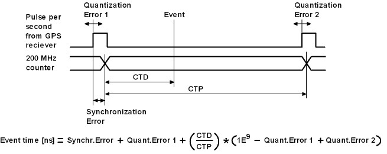
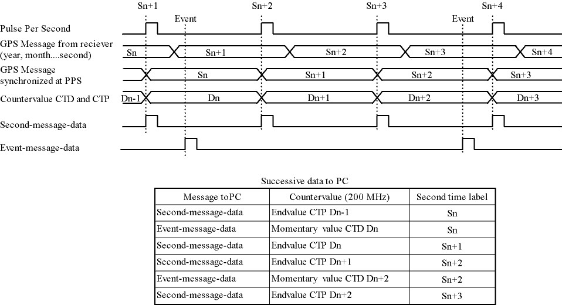
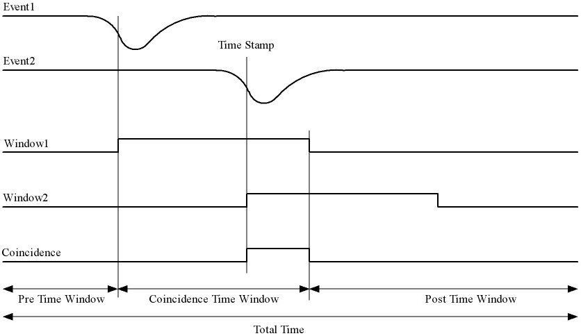

Message Structures HiSPARC
==========================

General message structure
-------------------------

====== ========== ============ ======= ===
Header Identifier Message info Data    End
====== ========== ============ ======= ===
99     1 byte     N bytes      N bytes 66
====== ========== ============ ======= ===

A message always starts with a header byte (99h) followed by an identifier
byte, message info, data and an end byte (66h). The identifier byte gives the
type of the message. Types are e.g. GPS time, measurement data, control
setting etc. The message info bytes give some information about the data.
Message info can be trigger information or time settings. In case of a control
setting this information is omitted (N = 0). The number of data bytes depends
on the type. In case of a control setting it will be a few bytes and in case
of measured event data it can be a few thousand bytes.
 

One second message
------------------

Every second on a pulse per second signal (1PPS) from the GPS receiver, the
HiSPARC electronics sends a message to the computer. The time information is
used for calibration. This message contains also the number of times that an
analog input signal went over a threshold level during 1 second. After these
bytes, 61 bytes of satellite signal information are send.

One second structure
^^^^^^^^^^^^^^^^^^^^

====== ========== ======= ======= ============ ============== =========== ===
Header Identifier GPS     CTP     Quantization Threshold      Satellite   End
                  time            Error        Counters Over  signal 
                  stamp                        threshold      information
                                               information
====== ========== ======= ======= ============ ============== =========== ===
99     A4         7 bytes 4 bytes 4 bytes      8 bytes        61 bytes    66
====== ========== ======= ======= ============ ============== =========== ===

The GPS Time stamp is data from the GPS receiver and will be renewed every
second.

GPS Time stamp structure
^^^^^^^^^^^^^^^^^^^^^^^^

====== ====== ======= ====== ======= =======
Day    Month  Year    Hours  Minutes Seconds
====== ====== ======= ====== ======= =======
1 byte 1 byte 2 bytes 1 byte 1 byte  1 byte
====== ====== ======= ====== ======= =======

CTP (Count Ticks between PPS) is a counter value. CTP represents the number of
clock periods of the 200 MHz clock between two PPS signals. This value will be
renewed every second. It will be set to one on a PPS signal and counts up in
5 ns steps till the next PPS signal. On a PPS signal this value is stored and
set to one again.

Quantization Error
^^^^^^^^^^^^^^^^^^

This field carries the PPS quantization error in units of nanoseconds.

Threshold counters over threshold information
^^^^^^^^^^^^^^^^^^^^^^^^^^^^^^^^^^^^^^^^^^^^^

======= ======= ======= =======
Threshold Counters
-------------------------------
Channel 2       Channel 1
--------------- ---------------
high    low     high    low
======= ======= ======= =======
2 bytes 2 bytes 2 bytes 2 bytes
======= ======= ======= =======

Satellite signal information
^^^^^^^^^^^^^^^^^^^^^^^^^^^^

+-----------+---------+-------+----------+---------+--------+ 
| Number of |Satellite|Signal |Satellite |Satellite|Signal  |
| tracked   |number 1 |level 1|numbers   |number 12|level 12|
| satellites|         |       |and levels|         |        |
|           |         |       |2 to 11   |         |        |
+===========+=========+=======+==========+=========+========+ 
| 1 byte    |1 byte   |4 bytes|50 bytes  |1 byte   |4 bytes |
+-----------+---------+-------+----------+---------+--------+ 

How to calculate the right event time
-------------------------------------

The electronics generates event-message-data and second-message-data. The
event-message-data is labeled on second basis by the GPS time stamp. To get
the event time in nanosecond accuracy, the following has to be done. Take for
example an event measured in time Sn (second n). The event-data contains a CTD
value. This is the counter value of the system 200 MHz counter latched at the
incomming event. The CTD value represents the number of 5 ns steps from a PPS
(Pulse Per Second) signal till the incomming event. A PPS signal comes every
second from the GPS reciever. First the ratio between CTD and CTP has to be
calculated. CTP is the end value of the 200 MHz counter at the moment of a PPS
signal. The CTP value belonging to the CTD value of Sn comes in the 
second-message-data of Sn+1. This ratio has to be multiplied with a "real"
second expressed in nanoseconds. The time between two PPS signals should be
exactly one second. Unfortunately the PPS signals have a time error with
respect to a "world second". This error is called the quantization error and
can be read from the second-message-data. The quantization errors for
event-message-data Sn are in second-message-data Sn+1 (Quantization error 1)
en second-message-data Sn+2 (Quantization error 2). Now the ratio CTD/CTP can
be expressed in nanoseconds and has to be add with a time offset. The time
offset is the sum of the first quantization error and a synchronization error.
By synchronizing the asynchrone PPS signal with the 200 MHz counter a
synchronization error is made. This could be an error of maximal 5 ns. This is
reduced to 2.5 ns by clocking the least significant bit of the counter on the
negative edge of the 200 MHz system clock also. The highest bit (bit31) of CTP
in the second-message-data indicates if the time offset has to be adjust with
2.5 ns. The synchronization error for event-message-data Sn is in 
second-message-data Sn.

Example of dataflow
-------------------

Measured data message
---------------------

On a coincidence of a chosen event pattern measured data will be sent to the
computer as follows.

Measurement data structure
^^^^^^^^^^^^^^^^^^^^^^^^^^

====== ========== ========= ======= ======= ======= ======= ======= ======= ======= ===
Header Identifier Trigger   Trigger Pre     Trigger Post    GPS     CTP     Data    End
                  condition pattern trigger time    trigger time
                                    time    window  time    stamp
                                    window          window
====== ========== ========= ======= ======= ======= ======= ======= ======= ======= ===
99     A0         1 byte    2 bytes 2 bytes 2 bytes 2 bytes 7 bytes 4 bytes N bytes 66
====== ========== ========= ======= ======= ======= ======= ======= ======= ======= ===
 

Trigger condition
-----------------

The trigger condition byte is set by Labview. The content of this byte selects
a pattern that allows a coincidence of the input event signals which go over
threshold. Every input signal can be discriminated with two threshold levels;
a low- and a high level. A HiSPARC electronic unit has two inputs. Two units
can be combined as a master and a slave. Therefore combinations can be made of
eight input signals over threshold voltages (threshold signals). There are
four high signals and four low signals. If a slave is not present, the high
and low signals from the slave are zero. A coincidence can also be forced with
an external trigger signal. The trigger condition of threshold signals is
selected with bit 0 to 5 of the trigger matrix byte. The external trigger is
selected with bit 6. The most significant bit selects the calibration mode.
When this bit is active, the other 7 bits are omitted. If a signal goes above
the high threshold, then of course it also goes above the low threshold.
Therefore if the condition is e.g. "at least two low signals", then this means
that the condition is also met when there is one signal low and one high. Or
if there are two high signals. Or when there is one high signal and two low
ones, etc.

================= ========= =========== ======================================
Trigger condition Description trigger condition
================= ============================================================
00 000 001        0H and 1L Tr. con. 1  At least one low signal
00 000 010        0H and 2L Tr. con. 2  At least two low signals
00 000 011        0H and 3L Tr. con. 3  At least three low signals
00 000 100        0H and 4L Tr. con. 4  At least four low signals
00 001 000        1H and 0L Tr. con. 5  At least one high signal
00 001 001        1H and 1L Tr. con. 6  At least one high signal and
                                        at least one other low
00 001 010        1H and 2L Tr. con. 7  At least one high signal and
                                        at least two others low
00 001 011        1H and 3L Tr. con. 8  At least one high signal and
                                        at least three others low
00 010 000        2H and 0L Tr. con. 9  At least two high signals
00 010 001        2H and 1L Tr. con. 10 At least two high signals and
                                        at least one other low
00 010 010        2H and 2L Tr. con. 11 At least two high signals and
                                        at least two others low
00 011 000        3H and 0L Tr. con. 12 At least three high signals
00 011 001        3H and 1L Tr. con. 13 At least three high signals and
                                        at least one other low
00 100 000        4H and 0L Tr. con. 14 All four signals high
00 001 100        1H or 1L  Tr. con. 15 At least one high signal or
                                        at least one other low
00 001 101        1H or 2L  Tr. con. 16 At least one high signal or
                                        at least two others low
00 001 110        1H or 3L  Tr. con. 17 At least one high signal or
                                        at least three others low
00 001 111        1H or 4L  Tr. con. 18 At least one high signal or
                                        all four others low
00 010 100        2H or 1L  Tr. con. 19 At least two high signals or
                                        at least one other low
00 010 101        2H or 2L  Tr. con. 20 At least two high signals or
                                        at least two others low
00 010 110        2H or 3L  Tr. con. 21 At least two high signals or
                                        at least three others low
00 010 111        2H or 4L  Tr. con. 22 At least two high signals or
                                        all four others low
00 011 100        3H or 1L  Tr. con. 23 At least three high signals or
                                        at least one other low
00 011 101        3H or 2L  Tr. con. 24 At least three high signals or
                                        at least two others low
00 011 110        3H or 3L  Tr. con. 25 At least three high signals or
                                        at least three others low
00 011 111        3H or 4L  Tr. con. 26 At least three high signals or
                                        all four others low
00 100 100        4H or 1L  Tr. con. 27 All four signals high or
                                        at least one other low
00 100 101        4H or 2L  Tr. con. 28 All four signals high or
                                        at least two others low
00 100 110        4H or 3L  Tr. con. 29 All four signals high or
                                        at least three others low
00 100 111        4H or 4L  Tr. con. 30 All four signals high or
                                        all four others low
01 000 000                  Tr. con. 31 Use external trigger only
01 xxx xxx                  Tr. con. 32 Use external trigger and selected
                                        trigger condition given by the xxx xxx
1x xxx xxx                  Tr. con. 33 Calibration Mode
================= ========= =========== ======================================

Trigger pattern
---------------

The trigger pattern contains two bytes. The lower byte gives the status of the
threshold signals at the coincidence. Later on, in the analysis, one can trace
back which signals(s) made the coincidence happen, taking the trigger
condition in account. The higher byte contains information about the HiSPARC
electronic set and the external trigger. Each channel has two hardware
comparators on the analog input. The input signal is compared with two
threshold levels: -5 V and -10 V. These levels are beyond the ADC
digitalization range. The compared signals are also latched at a coincidence.

==================== =================================
Trigger pattern bits Description
==================== =================================
Lower byte, bit 0    Master Channel 1 lower threshold
Lower byte, bit 1    Master Channel 1 higher threshold
Lower byte, bit 2    Master Channel 2 lower threshold
Lower byte, bit 3    Master Channel 2 higher threshold
Lower byte, bit 4    Slave Channel 1 lower threshold
Lower byte, bit 5    Slave Channel 1 higher threshold
Lower byte, bit 6    Slave Channel 2 lower threshold
Lower byte, bit 7    Slave Channel 2 higher threshold
Higher byte, bit 0   External trigger
Higher byte, bit 1   Master (1) or slave (0)
Higher byte, bit 2   Slave present
Higher byte, bit 3   Channel 1 comparator level low
Higher byte, bit 4   Channel 1 comparator level high
Higher byte, bit 5   Channel 2 comparator level low
Higher byte, bit 6   Channel 2 comparator level high
Higher byte, bit 7   Calibration Mode
==================== =================================

Time Windows
------------

There are three time windows which are placed next to each other. Together
they form the total time in which the data of an event is stored and readout.

The Pre time window can be set from 0 µs to 2 µs.

The Coincidence time window can be set from 0 µs to 5 µs.

The Post time window can be set from 0 µs to 8 µs.

The coincidence window time may not be larger than the post window time. The
total time may not be larger than 10 us.

The times are set in 5 ns steps. In other words the contents of the pre time
window byte must be between 0 and 400. The value of the coincidence window
byte must be between 0 and 1000. The value of the post time window byte must
be between 0 and 1600.

Data Time
---------

On a coincidence the momentarily time is latched. The time consists of the GPS
time and the CTP (Count Ticks between PPS) time.

Data
----

The sum of the three window bytes cannot exceed 2000 steps of 5 ns. The time
resolution of one channel is 2.5 ns. The analog input is sampled with a 12 bit
amplitude resolution and the output words to the computer are 8 bit. This
means that there are 1.5 times more output words than sampled values per
channel. Therefore the number of data output bytes is six times (5 ns / 2.5 ns
x 2 channels x 1.5) the sum of the three window bytes.

Comparator data message
-----------------------

As said before: Each channel has two hardware comparators on the analog input.
The input signal is compared with two threshold levels: -5 V and -10 V. If the
input signal exceeds one of the levels, the GPS time is latched and the time
the signal stays larger than the level is counted in 5 ns steps. If one or more
comparators detect a input signal larger then their level, a message is
generated.

Comparator data structure
^^^^^^^^^^^^^^^^^^^^^^^^^

====== ========== ========== ======= ======= ================== ===
Header Identifier Comparator GPS     CTP     Comparator Counter End
                  Identifier time            Signal over
                             stamp           threshold time
====== ========== ========== ======= ======= ================== ===
99     A2         1 byte     7 bytes 4 bytes 4 bytes            66
====== ========== ========== ======= ======= ================== ===

Comparator Identifier
^^^^^^^^^^^^^^^^^^^^^

===================== =====================
Comparator Identifier Comparator
===================== =====================
0000 0001             -5 V level Channel 1
0000 0010             -10 V level Channel 1
0000 0100             -5 V level Channel 2
0000 1000             -10 V level Channel 2
===================== =====================

Control parameters
------------------

Individually parameters control structure
^^^^^^^^^^^^^^^^^^^^^^^^^^^^^^^^^^^^^^^^^

====== ========== ======= ===
Header Identifier Data    End
====== ========== ======= ===
99     See list   N bytes 66
====== ========== ======= ===

Control parameters from identifier 10 to 35 can be written individual by
Labview.

Set control parameter list structure
^^^^^^^^^^^^^^^^^^^^^^^^^^^^^^^^^^^^

====== ========== ======== ===
Header Identifier Data     End
====== ========== ======== ===
99     50         35 bytes 66
====== ========== ======== ===

When applying identifier 50 all settings from identifier 10 to 33 and 35 can
be written in one message.

Get control parameter list structure
^^^^^^^^^^^^^^^^^^^^^^^^^^^^^^^^^^^^

(Send by software)

====== ========== ===
Header Identifier End
====== ========== ===
99     55         66
====== ========== ===

When applying identifier 55 all settings from identifier 10 to 47 will be send
in one message.

(Return by HiSPARC electronics)

====== ========== ======== ===
Header Identifier Data     End
====== ========== ======== ===
99     55         76 bytes 66
====== ========== ======== ===

Soft reset
^^^^^^^^^^

====== ========== ===
Header Identifier End
====== ========== ===
99     FF         66
====== ========== ===

When applying identifier FF the electronics get a soft reset and the default
values from the control parameter list will be applied.

Communication error
^^^^^^^^^^^^^^^^^^^

====== ========== ====== ===
Header Identifier Data   End
====== ========== ====== ===
99     55         1 byte 66
====== ========== ====== ===

If a message is misunderstood by the electronics, a message with identifier 88
following with the identifier of the misunderstood message will be send in
return. If the header byte is not detected, the data byte will be 99. If an
identifier of a non existing message is detected, the data byte will be 89. If
the end byte is not detected, the data byte will be 66.

Control parameter list
^^^^^^^^^^^^^^^^^^^^^^

========== ======= ================================= =========================
Identifier N bytes Description                       Default Value
========== ======= ================================= =========================
10         1       Channel 1 Offset adjust positive  80
11         1       Channel 1 Offset adjust negative  80
12         1       Channel 2 Offset adjust positive  80
13         1       Channel 2 Offset adjust negative  80
14         1       Channel 1 Gain adjust positive    80
15         1       Channel 1 Gain adjust negative    80
16         1       Channel 2 Gain adjust positive    80
17         1       Channel 2 Gain adjust negative    80
18         1       Common offset adjust              00
19         1       Full scale adjust                 00
1A         1       Channel 1 Integrator time         FF
1B         1       Channel 2 Integrator time         FF
1C         1       Comparator threshold low          58 (-5 V)
1D         1       Comparator threshold high         E6 (-10 V)
1E         1       Channel 1 PMT high voltage adjust 00 (0.3 V - 1.5 V)
1F         1       Channel 2 PMT high voltage adjust 00  
20         2       Channel 1 Threshold low           0100 (125 mV)
21         2       Channel 1 Threshold high          0800 (1 V)
22         2       Channel 2 Threshold low           0100 (125 mV)
23         2       Channel 2 Threshold high          0800 (1 V)
30         1       Trigger condition                 08 (at least one high)
31         2       Pre coincidence time              00C8 (1 µs)
32         2       Coincidence time                  0190 (2 µs)
33         2       Post coincidence time             0190 (2 µs)
34         1       Status electronics
35         4       Spare bytes
40         1       Channel 1 PMT supply current      FF corresponds with 25 mA
41         1       Channel 2 PMT supply current      FF corresponds with 25 mA
42         7       GPS time stamp
43         8       GPS position longitude
44         8       GPS position latitude
45         8       GPS position altitude
46         4       Temperture electronics
47         3       Version number
50         35      Set control parameter list
55         0       Get control parameter list
88         1       Communication error
FF         0       Reset electronics
========== ======= ================================= =========================

Status byte
-----------

At the moment only bit 0, 1 and 7 are implemented. Bits 6 down to 2 are zero.
Bit 0 is the master bit and will be high if the electronics have a GPS on
board. Bit 1 is the slave-present bit and will be high if a slave unit is
detected.

Version number
--------------

The version number has a length of three bytes and consists of two parts: a
software- and a hardware part. The ten lower bits (9 down to 0) represent a
hardware serial number. Each unit has his own serial number / address and is
set by jumpers on the board. The eight higher bits (23 down to 16) represent a
software version of the code of the field programmable gate array (FPGA). Bits
15 down to 10 are logical zero.

How to startup
--------------

Connect the HiSPARC Electronics via USB with the PC and switch the power of
the electronics on. Run the LabView program and a master module should be
recognized as "HiSPARC II Master" and a slave module as "HiSPARC II Slave".
After switching the electronics on or after a soft reset, the electronics is
in listing mode. This means that there will be no data send from the
electronics to the PC. To put the electronics in writing mode also, the least
significant bit of Spare bytes has to be set. Thus the first command for
LabView to send must be 99 35 00 00 00 01 66. After this, the statusword can
be asked by applying a get control parameter list command (99 55 66). The
statusword can be found in the 32th byte returned data. There can be checked
if the module is a master (least significant bit - b0 = '1') or a slave (b0 =
'0'). When a slave module is attached to a master, then b1 = '1' in the
statusword of the master. After switching the electronics on or after a soft
reset, the module does not send one second messages. To put this on, bit 1 of
Spare bytes has to be set also by sending 99 35 00 00 00 03 66. Now, the
electronics is fully up and running.

Features
--------

- From startup it is not possible to program the GPS reciever. This can be
  enabled by setting bit 2 of Spare bytes to '1'. If this bit is set, it is
  possible to program the GPS reciever with the software from Trimble.
- Only a master and slave combination can work like a 4 channel oscilloscoop.
  The master generates a common trigger for the two modules from the data of
  the four inputs. To let a master/master or slave/slave combination work, a
  master has to be forced to work as slave or a slave as master. This can be
  done when bit 3 of Spare bytes is set to '1'. This bit alternates the
  master/slave state.
